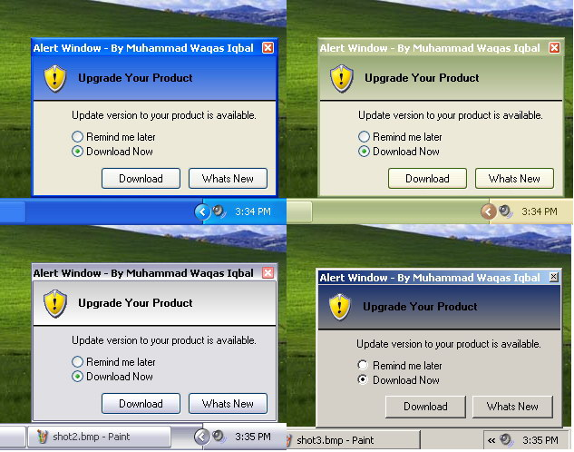



## MSN Style Alert Window 3\.0

### Description

MSN style alert now in windows form with title bar, it neither

requires activeX control nor any DLL file. You can even change

sound of Alert Window, just by changing 'PlaySoundResource' in

FormLoad event form 101 to 103. You can also add your own

sound, just add wave file in the resource file under the heading

'WAVE'.

Gradient effect is now included in the version of Alert

Window in prior version you could use only one color of heading

area but in this version you can use gradient effect of two colors

of your desire. You can not only change the colors of gradient

of your of desire but also change the angle of gardient.

For example: 90 or -90. All you need to do just change color

and anlge in FormLoad Event as simple as that.

Another upgrade version of Alert Window is now here, in this version

of Alert Window FadeIn and FadeOut effect of form isincluded. You can

set FadeIn and FadeOut duration as you like by adding 'Step' code

in ForNext loop in FormLoad Event from 1 to 255 depends on you need. Still more to come with new exciting feature and which will allow multiple Alert Window. Plz vote for it if u like and drope a critical comment if u dont. plz report any bug if u find.
 
### More Info
 

             |
---                |---
**Submitted On**   |2005-06-12 03:21:38
**By**             |[Muhammad Waqas Iqbal](https://github.com/Planet-Source-Code/PSCIndex/blob/master/ByAuthor/muhammad-waqas-iqbal.md)
**Level**          |Intermediate
**User Rating**    |5.0 (10 globes from 2 users)
**Compatibility**  |VB 6\.0
**Category**       |[Custom Controls/ Forms/  Menus](https://github.com/Planet-Source-Code/PSCIndex/blob/master/ByCategory/custom-controls-forms-menus__1-4.md)
**World**          |[Visual Basic](https://github.com/Planet-Source-Code/PSCIndex/blob/master/ByWorld/visual-basic.md)
**Archive File**   |[MSN\_Style\_1900946132005\.zip](https://github.com/Planet-Source-Code/muhammad-waqas-iqbal-msn-style-alert-window-3-0__1-61107/archive/master.zip)

